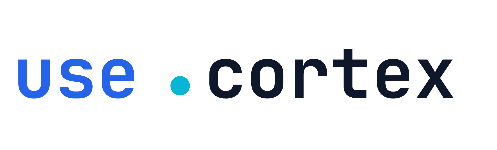
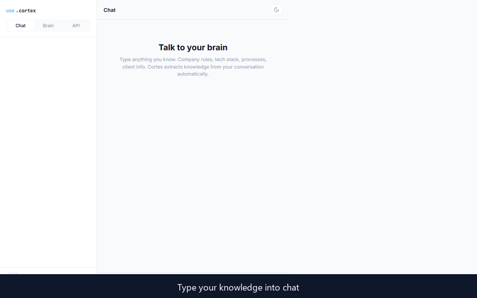

<p align="center">
  
</p>

<h1 align="center">UseCortex MCP Server</h1>

<p align="center">
  <strong>Give your AI coding agent a persistent memory — read and write knowledge from any tool.</strong>
</p>

<p align="center">
  <a href="https://glama.ai/mcp/servers/darktw/usecortex-mcp"></a>
</p>

<p align="center">
  <a href="https://usecortex.net">Website</a> &middot;
  <a href="#quick-start">Quick Start</a> &middot;
  <a href="#available-tools">Tools</a> &middot;
  <a href="#pricing">Pricing</a>
</p>

<p align="center">
  
</p>

---

UseCortex MCP is a [Model Context Protocol](https://modelcontextprotocol.io) server that gives AI coding agents persistent memory. Your agent can read knowledge you've stored and write new discoveries back — all through a single encrypted endpoint.

No context window limits. No copy-pasting. No outdated docs. Your AI remembers everything.

## How It Works

1. **You chat** — describe your coding standards, architecture decisions, client requirements, anything
2. **UseCortex extracts** — AI automatically organizes facts into structured topics
3. **Your agent recalls** — any MCP-compatible tool can query your knowledge instantly
4. **Knowledge grows** — your agent can push new discoveries back, so your knowledge base stays current

## Features

- **Two-way knowledge flow** — read context into projects, write discoveries back
- **Works with any MCP client** — compatible with any AI coding agent that supports the Model Context Protocol
- **Encrypted at rest** — AES-256 encryption with per-user keys
- **No vendor lock-in** — your knowledge works across every AI tool
- **Structured by topic** — knowledge auto-organized, not dumped in one pile

## Quick Start

### Prerequisites

- A free [UseCortex](https://usecortex.net) account
- An MCP-compatible AI coding agent

### 1. Generate an API key

Sign up at [usecortex.net](https://usecortex.net), then navigate to **Settings → API Keys → Generate**.

> **Note:** Copy the key immediately after generation. It will not be shown again.

### 2. Install (one command)

Run this in your terminal — replace `YOUR_API_KEY` with the key from step 1:

```bash
claude mcp add usecortex --transport url https://api.usecortex.net/mcp --header "Authorization: Bearer YOUR_API_KEY"
```

That's it. Restart your AI coding agent and UseCortex tools are ready.

<details>
<summary>Manual setup (alternative)</summary>

If you prefer to configure manually, add this to your MCP client config file:

```json
{
  "mcpServers": {
    "usecortex": {
      "type": "url",
      "url": "https://api.usecortex.net/mcp",
      "headers": {
        "Authorization": "Bearer YOUR_API_KEY"
      }
    }
  }
}
```

Replace `YOUR_API_KEY` with the key generated in step 1.

</details>

## Available Tools

### `query_knowledge`

Ask a natural language question and get an AI-powered answer based on your stored knowledge.

| Parameter | Type     | Required | Description                                    |
|-----------|----------|----------|------------------------------------------------|
| `query`   | `string` | Yes      | Natural language question                      |
| `topic`   | `string` | No       | Filter by specific topic                       |

### `list_topics`

List all knowledge topics. Takes no parameters.

### `add_knowledge`

Write new knowledge to your base. Your agent can store discoveries, decisions, or patterns it finds.

| Parameter | Type     | Required | Description                                    |
|-----------|----------|----------|------------------------------------------------|
| `content` | `string` | Yes      | The knowledge to store                         |
| `topic`   | `string` | No       | Topic to file under (auto-detected if omitted) |

### `get_topic`

Retrieve all knowledge entries for a specific topic.

| Parameter | Type     | Required | Description                        |
|-----------|----------|----------|------------------------------------|
| `topic`   | `string` | Yes      | Topic name to retrieve             |

### `search_knowledge`

Search knowledge entries by keyword (text match).

| Parameter | Type     | Required | Description                        |
|-----------|----------|----------|------------------------------------|
| `query`   | `string` | Yes      | Search term                        |

### `capture_session` *(Memory plan)*

Capture an AI session summary into persistent memory. Store what you learned, decided, or built.

| Parameter      | Type       | Required | Description                                    |
|----------------|------------|----------|------------------------------------------------|
| `summary`      | `string`   | Yes      | Compressed summary of the session              |
| `tool`         | `string`   | No       | AI tool used (claude-code, cursor, chatgpt)    |
| `project`      | `string`   | No       | Project name or path                           |
| `tags`         | `string[]` | No       | Tags for categorization                        |
| `observations` | `string`   | No       | Detailed observations as JSON string           |

### `recall_memory` *(Memory plan)*

Search across all captured session memories using AI. Ask what you worked on or what decisions were made.

| Parameter | Type     | Required | Description                                    |
|-----------|----------|----------|------------------------------------------------|
| `query`   | `string` | Yes      | Natural language question about past sessions  |
| `tool`    | `string` | No       | Filter by AI tool                              |
| `project` | `string` | No       | Filter by project                              |
| `limit`   | `number` | No       | Max results (default 20)                       |

### `list_sessions` *(Memory plan)*

List recent captured session memories.

| Parameter | Type     | Required | Description                        |
|-----------|----------|----------|------------------------------------|
| `tool`    | `string` | No       | Filter by AI tool                  |
| `project` | `string` | No       | Filter by project                  |
| `limit`   | `number` | No       | Max results (default 10)           |

## Use Cases

| Who               | What                                                                  |
|-------------------|-----------------------------------------------------------------------|
| **Developers**    | Your coding standards, architecture decisions, and project context — automatically available to your AI agent |
| **Support teams** | Feed real policies and procedures to any support bot — it answers with facts, not guesses |
| **Sales teams**   | Store client history, pricing, and objections — pull everything before meetings |
| **Individuals**   | Your personal brain backup — everything you know, encrypted and accessible from any AI tool |
| **HR & Onboarding** | Your company playbook — processes, tools, culture — available to new hires instantly |

## Pricing

|                          | Free       | Pro ($9/mo)  | Memory ($19/mo) | Team ($39/mo) |
|--------------------------|------------|--------------|-----------------|---------------|
| Knowledge entries        | 100        | Unlimited    | Unlimited       | Unlimited     |
| Topics                   | 3          | Unlimited    | Unlimited       | Unlimited     |
| API calls/month          | 500        | 10,000       | 50,000          | 200,000       |
| Two-way API              | Read only  | Yes          | Yes             | Yes           |
| AI session capture       | —          | —            | Yes             | Yes           |
| Memory recall            | —          | —            | Yes             | Yes           |
| Markdown sync            | —          | —            | Yes             | Yes           |
| Session history          | —          | —            | 90 days         | Unlimited     |
| API keys                 | 1          | 5            | 10              | 50            |
| Team members             | —          | —            | —               | 25            |
| Audit logs               | —          | —            | —               | Yes           |

Manage your plan at [usecortex.net](https://usecortex.net).

## Security

- All communication encrypted over HTTPS
- Knowledge encrypted at rest with AES-256
- Per-user encryption keys — even we can't read your data
- API keys scoped per user with instant revocation

## Contributing

Found a bug or have a feature request? [Open an issue](https://github.com/usecortex-official/cortex-mcp/issues).

## Links

- [UseCortex](https://usecortex.net) — Create your account and manage knowledge
- [cortex-cli](https://github.com/usecortex-official/cortex-cli) — CLI for markdown sync & terminal usage
- [Model Context Protocol](https://modelcontextprotocol.io) — Learn about MCP

## License

[MIT](LICENSE)

---

© 2026 Altazi Labs, Inc. All rights reserved. · [contact@altazilabs.com](mailto:contact@altazilabs.com)
